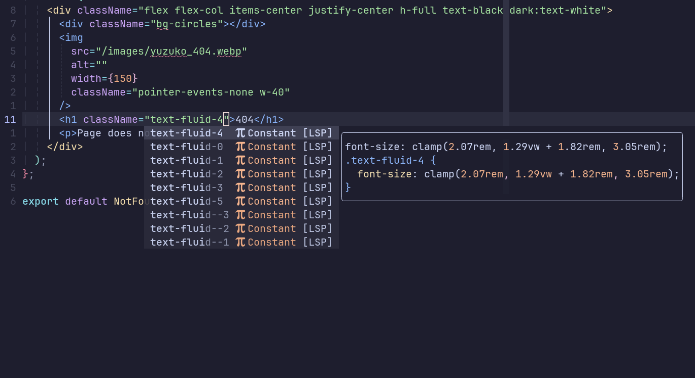

<div align="center">
  
  
  <h1>CSS Modular Type</h1>
  <a href="https://github.com/schardev/css-modular-type/actions/workflows/ci.yml">
    
    
  </a>
</div>
<p align="center">A <a href="https://github.com/postcss">PostCSS</a> and <a href="https://github.com/tailwindlabs/tailwindcss">TailwindCSS</a> plugin to generate modular type scales, inspired by <a href="https://www.fluid-type-scale.com/">Fluid Type Scale Calculator</a>.</p>
<br/>

> **Warning**
>
> Still in beta. Report any issues if found.

## Getting Started

### Installation

```bash
# npm
npm install css-modular-type --save-dev

# or yarn
yarn add -D css-modular-type

# or pnpm
pnpm add -D css-modular-type
```

### Usage

You can add this plugin as a PostCSS plugin inside your `postcss.config.js`:

```javascript
// postcss.config.js
const postcss = require("css-modular-type/postcss");
// or just `require('css-modular-type)` as `postcss` is the default export;
// const postcss = require("css-modular-type")

module.exports = {
  plugins: [postcss()],
};
```

Or as a TailwindCSS plugin by adding in your `tailwind.config.js` file:

```js
module.exports = {
  /* ... other tailwind styles ... */
  theme: {},
  plugins: [require("css-modular-type/tailwind")],
};
```

#### Input

```css
:root {
  /* css-modular-type-generate */
}
```

#### Output

```css
:root {
  --font-size--2: clamp(0.69rem, 0.01vw + 0.69rem, 0.70rem);
  --font-size--1: clamp(0.83rem, 0.14vw + 0.81rem, 0.94rem);
  --font-size-0: clamp(1.00rem, 0.33vw + 0.93rem, 1.25rem);
  --font-size-1: clamp(1.20rem, 0.61vw + 1.08rem, 1.67rem);
  --font-size-2: clamp(1.44rem, 1.03vw + 1.23rem, 2.22rem);
  --font-size-3: clamp(1.73rem, 1.62vw + 1.40rem, 2.96rem);
  --font-size-4: clamp(2.07rem, 2.46vw + 1.58rem, 3.95rem);
  --font-size-5: clamp(2.49rem, 3.65vw + 1.76rem, 5.26rem)}
}
```

## Configuration

The plugin comes with the following default configuration, but it is possible to customise pretty much all config options to your liking.

### Default configuration

```javascript
module.exports = {
  plugins: [
    require("css-modular-type")({
      minScreenWidth: 320,
      maxScreenWidth: 1536,
      minFontSize: 16,
      maxFontSize: 20,
      minRatio: 1.2,
      maxRatio: 1.333,
      minStep: 2,
      maxStep: 5,
      precision: 2,
      prefix: "font-size-" /* set to "fluid-" in tailwind plugin */,
      rootFontSize: 16,
      suffixType: "numbered" /* set to "values" in tailwind plugin */,
      suffixValues: ["xs", "sm", "base", "md", "lg", "xl", "2xl", "3xl"],
      unit: "rem",
      replaceInline: false /* postcss plugin only */,
      generatorDirective: "css-modular-type-generate" /* postcss plugin only */,
    }),
  ],
};
```

### Options

> **Note**
>
> Options marked as **`(p)`** only applies to `postcss` plugin.

#### `minScreenWidth`

**Type:** `number`

Viewport width of your font's baseline step on minimum (mobile) screens widths.

#### `maxScreenWidth`

**Type:** `number`

Viewport width of your font's baseline step on maximum (desktop) screens widths.

#### `minFontSize`

**Type:** `number`

Minimum font size of your baseline step on minimum (mobile) screen widths. The base font size won't go **below** this size when the viewport is at `minScreenWidth` or below.

#### `maxFontSize`

**Type:** `number`

Maximum font size of your baseline step on maximum (desktop) screen widths. The base font size won't go **above** this size when the viewport is at `maxScreenWidth` or above.

#### `minRatio` | `maxRatio`

**Type:** `number`

Font scaling ratio for minimum/maximum screen width. Could be one of the ratio given below or a custom one.

- `1.067` (Minor Second)
- `1.125` (Major Second)
- `1.200` (Minor Third)
- `1.250` (Major Third)
- `1.333` (Perfect Fourth)
- `1.414` (Augmented Fourth)
- `1.500` (Perfect Fifth)
- `1.618` (Golden Ratio)

#### `minStep`

**Type**: `number`

Minimum steps of font scales to produce (excluding your base font size on minimum screen width). So, if you set `minStep` to `2` and `maxStep` to `5`, it'll generate `8` font scales variables i.e, `minStep` + `maxStep` + `1` (base font size).

#### `maxStep`

**Type**: `number`

Maximum steps of font scales to produce (excluding your base font size on maximum screen width). So, if you set `minStep` to `1` and `maxStep` to `3`, it'll generate `5` font scales variables i.e, `minStep` + `maxStep` + `1` (base font size).

#### `rootFontSize`

**Type:** `number`

Root font size (default is usually `16px` on all browsers). This is used to calculate `rem` values.

#### `precision`

**Type:** `number`

Precision of generated font values.

#### `prefix`

**Type:** `string`

Prefix of generated font variables.

#### `suffixType`

**Type:** `"numbered"` | `"values"`

Suffix to use for generated font scales. Could be one of:

- `numbered`: Generated font variables will have the format of `--${prefix}${number}`. For example, with default configuration, it'll generate variables as: `--font-size--1`, `--font-size-0`, `--font-size-2` etc.

- `values`: Generated font variables will have the format of `--${prefix}${suffixValues[<font-step>]}`. For example, if `suffixType` is set to `values`, it'll generate variables with suffix from `suffixValues` config option, like: `--font-size-sm`, `--font-size-base`, `--font-size-md`, etc.

#### `suffixValues`

**Type:** `string[]` | `(defaultValues: string[]) => string[]`

Array of suffix for each step in your type scale, in ascending order of font size. Will be used if `suffixType` is set to `values`.

Also takes a function which is called with the default values in case you want to extend the default values array like:

```js
// postcss.config.js
module.exports = {
  plugins: [
    require("css-modular-type")({
      minStep: 3,
      maxStep: 6,
      suffixType: "values",
      suffixValues: (defaultValues) => ["2xs", ...values, "4xl"],
    }),
  ],
};

// will generate font values as: ["2xs", "xs", "sm", "base", "md", "lg", "xl", "2xl", "3xl", "4xl"]
```

#### `unit`

**Type:** `"px"` | `"rem"`

Unit of output CSS.

#### `replaceInline` **`(p)`**

**Type:** `boolean`

Whether to replace font variables inline.

Although, it is recommended to include all font variables using [`generatorDirective`](#generatordirective) inside your `:root {}` selector so that you can access them globally, however, if you prefer to replace them inline you can do so by enabling `replaceInline`:

```javascript
// postcss.config.js
module.exports = {
  plugins: [
    require("css-modular-type")({
      replaceInline: true,
    }),
  ],
};
```

##### Input

```css
/* other styles */
button {
  font-size: var(--font-size-1);
}
```

##### Output

```css
/* other styles */
button {
  font-size: clamp(1.2rem, 0.61vw + 1.08rem, 1.67rem);
}
```

#### `generatorDirective` **`(p)`**

**Type:** `string`

Generator directive string. Adding this string (as a comment) in any CSS selector will replace it with generated font variables. Requires `replaceInline` to be disabled.

It is recommended that you put this into your `:root {}` CSS selector so that you can access font variables globally.

#### `insertMinMaxFontAsVariables` **`(p)`**

**Type:** `boolean`

Whether to insert min and max font size as variables instead of inserting them directly.

```javascript
// postcss.config.js
module.exports = {
  plugins: [
    require("css-modular-type")({
      insertMinMaxFontAsVariables: true,
    }),
  ],
};
```

##### Input

```css
:root {
  /* css-modular-type-generate */
}
```

##### Output

```css
:root {
  --font-size-min--2: 0.69rem;
  --font-size-max--2: 0.7rem;
  --font-size--2: clamp(
    var(--font-size-min--2),
    0.01vw + 0.69rem,
    var(--font-size-max--2)
  );
  --font-size-min--1: 0.83rem;
  --font-size-max--1: 0.94rem;
  --font-size--1: clamp(
    var(--font-size-min--1),
    0.14vw + 0.81rem,
    var(--font-size-max--1)
  );
  --font-size-min-0: 1rem;
  --font-size-max-0: 1.25rem;
  --font-size-0: clamp(
    var(--font-size-min-0),
    0.33vw + 0.93rem,
    var(--font-size-max-0)
  );
  --font-size-min-1: 1.2rem;
  --font-size-max-1: 1.67rem;
  --font-size-1: clamp(
    var(--font-size-min-1),
    0.61vw + 1.08rem,
    var(--font-size-max-1)
  );
  --font-size-min-2: 1.44rem;
  --font-size-max-2: 2.22rem;
  --font-size-2: clamp(
    var(--font-size-min-2),
    1.03vw + 1.23rem,
    var(--font-size-max-2)
  );
  --font-size-min-3: 1.73rem;
  --font-size-max-3: 2.96rem;
  --font-size-3: clamp(
    var(--font-size-min-3),
    1.62vw + 1.4rem,
    var(--font-size-max-3)
  );
  --font-size-min-4: 2.07rem;
  --font-size-max-4: 3.95rem;
  --font-size-4: clamp(
    var(--font-size-min-4),
    2.46vw + 1.58rem,
    var(--font-size-max-4)
  );
  --font-size-min-5: 2.49rem;
  --font-size-max-5: 5.26rem;
  --font-size-5: clamp(
    var(--font-size-min-5),
    3.65vw + 1.76rem,
    var(--font-size-max-5)
  );
}
```

## TailwindCSS Plugin

In a `tailwind` project adding this plugin will create utility classes for changing font sizes. All options are the same between `postcss` and `tailwindcss` plugin (except for the ones marked as `postcss`-only).

Example usage:

```js
import tailwind from "css-modular-type/tailwind";

export default = {
  theme: {},
  plugins: [
    tailwind({
      suffixType: "numbered"
    }),
  ],
};
```

Shows added utilities in auto-completion:



## Acknowledgments

This plugin is mostly inspired by [this blog post](https://www.aleksandrhovhannisyan.com/blog/fluid-type-scale-with-css-clamp/) by [Aleksandr Hovhannisyan](https://github.com/AleksandrHovhannisyan).

Further resources:

- [Generating `font-size` CSS Rules and Creating a Fluid Type Scale](https://moderncss.dev/generating-font-size-css-rules-and-creating-a-fluid-type-scale/)
- [Flexible typography with CSS locks](https://blog.typekit.com/2016/08/17/flexible-typography-with-css-locks/)
- [UTOPIA](https://utopia.fyi/)
